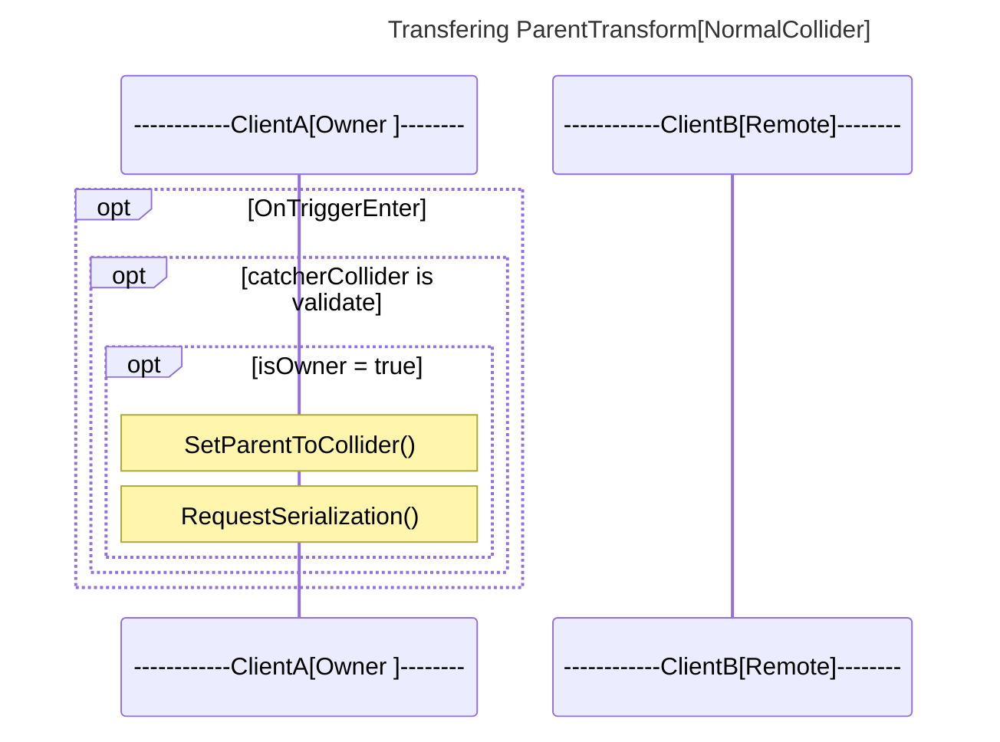
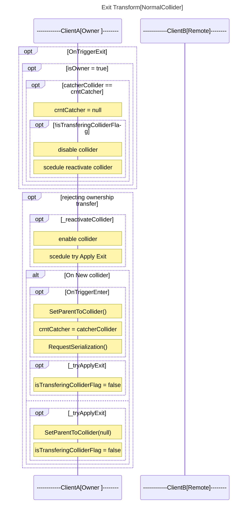

```mermaid
---
title: Transfering ParentTransform[NormalCollider]
---
sequenceDiagram
	participant ClientA as ------------ClientA[Owner ]--------
	participant ClientB as ------------ClientB[Remote]--------
	opt OnTriggerEnter
		opt catcherCollider is validate
			opt isOwner = true
			Note over ClientA: SetParentToCollider()
			Note over ClientA: RequestSerialization()
			end
		end
	end

```

```mermaid
---
title: Exit Transform[NormalCollider]
---
sequenceDiagram
	participant ClientA as ------------ClientA[Owner ]--------
	participant ClientB as ------------ClientB[Remote]--------
	opt OnTriggerExit
		opt isOwner = true
			opt catcherCollider == crntCatcher
				Note over ClientA: crntCatcher = null
				opt !isTransferingColliderFlag
					Note over ClientA: disable collider
					Note over ClientA: scedule reactivate collider
				end
			end
		end
	end
	opt rejecting ownership transfer
		opt _reactivateCollider
			Note over ClientA: enable collider
			Note over ClientA: scedule try Apply Exit
		end
		alt On New collider
			opt OnTriggerEnter
				Note over ClientA: SetParentToCollider()
				Note over ClientA: crntCatcher = catcherCollider
				Note over ClientA: RequestSerialization()
			end
			opt _tryApplyExit
				Note over ClientA: isTransferingColliderFlag = false
			end
		else
			opt _tryApplyExit
				Note over ClientA: SetParentToCollider(null)
				Note over ClientA: isTransferingColliderFlag = false
			end
		end
	end

```