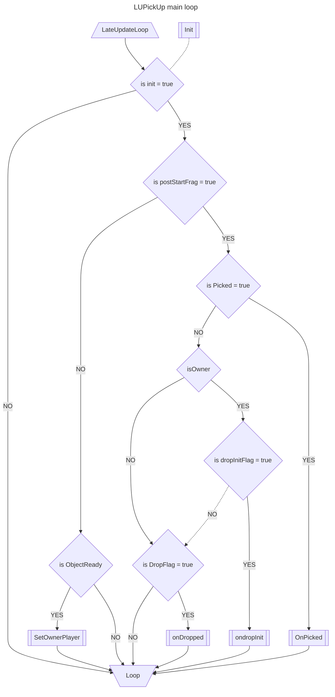
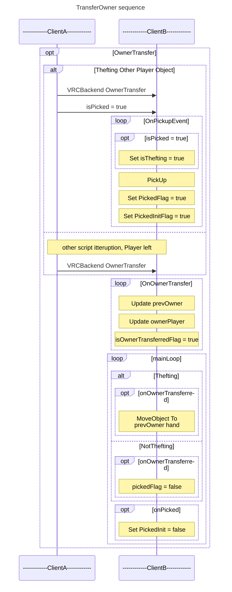
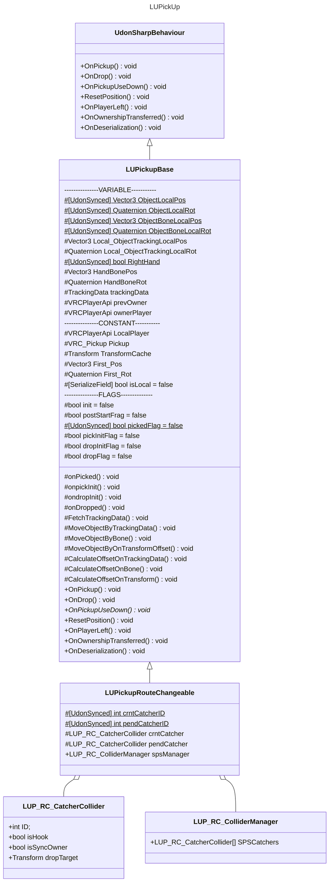

```mermaid
---
title: LUPickUp main loop
---

flowchart TD
	StartLoop[/LateUpdateLoop\] -->
	isInit{is init = true}

	isInit --NO--> EndLoop

	isInit --YES-->
	ispostStartFrag{is postStartFrag = true} --NO-->
	IsObjectReady{is ObjectReady} --YES-->
	postStartFrag[[SetOwnerPlayer]] -->
	EndLoop[\Loop/]


	IsObjectReady --NO-->
	EndLoop

	Init[[Init]] -.-
	isInit

	ispostStartFrag --YES-->
	isPicked{is Picked = true}

	isPicked --NO--> 
	isOwnerOnDrop

	isDropping --NO-->
	EndLoop

	isOwnerOnDrop{isOwner} --NO-->
	isDropping

	isdropInitFlag{is dropInitFlag = true} -.NO.->
	isDropping{is DropFlag = true}
	
	isDropping --YES--> onDropped[[onDropped]] --> EndLoop

	isPicked --YES--> 
	onPicked[[OnPicked]] -->
	EndLoop

	isOwnerOnDrop --YES--> 
	isdropInitFlag --YES--> 
	ondropInit[[ondropInit]] --> EndLoop
```

```mermaid
flowchart TD
	subgraph "OnDrop"
		

		MoveObjectTransformOnDropped[[Move Object Transform<br> on Dropped transform]] -->
		SetdropFlag_True

	end
	subgraph "ondropInit"

		FetchTrackingDataOnDrop[[Fetch TrackingData]]


		FetchTrackingDataOnDrop -->
		MoveObjectTransform_ByTrackingDataOnDrop[[Move Object Transform<br> by TrackingData]] -->
		CalculateOffsetOnPlayerOnDrop[[Calculate Offset<br> On Dropped transform]] -->
		SetdropInitFlag_True -->
		SyncOndropInit((sync))
	end
	
	subgraph "onpickInit"
		
		MoveObjectTransformOnPickup[[Move Object Transform<br> on Parent transform]] -->
		CalculateOffsetOnHand[[Calculate Offset<br> On Hand]]-->			
		CalculateOffsetOnBone[[Calculate Offset<br> On HandBone]]-->
		SyncOnpickInit((sync)) -->
		isVR{is VR} --YES--> 
		SetpickInitFlag_True
		
		
		isVR{is VR}--NO-->
		DeskTopWalkAround[[DeskTopWalkAround]] --> 
		SetpickInitFlag_True
		
		DeskTopWalkAround -."2Sec late".- SyncOnDeskTop((sync))
	end
	
	subgraph "OnPicked"
		FetchBoneDataOnPicked[[Fetch BoneData]] -->
		isOwnerOnPicked{isOwner}

		isOwnerOnPicked --NO-->
		MoveObjectTransform_FromBone[[Move Object Transform<br> by BonePosition]]

		isOwnerOnPicked --YES-->
		FetchTrackingDataOnPicked[[Fetch TrackingData]] -->
		ispickInitFlag{is pickInitFlag = true}

		ispickInitFlag --NO-->
		MoveObjectTransform_ByTrackingDataOnPickup
		
		ispickInitFlag --YES-->
		onpickInit_[[onpickInit]]

		onpickInit_ -->
		MoveObjectTransform_ByTrackingDataOnPickup[[Move Object Transform<br> by TrackingData]]

	end
```

```mermaid
---
title: TransferOwner sequence
---
sequenceDiagram
	participant ClientA as ------------ClientA------------
	participant ClientB as ------------ClientB------------
	opt OwnerTransfer
		alt Thefting Other Player Object
			ClientA ->> ClientB: VRCBackend OwnerTransfer
			ClientA ->> ClientB: isPicked = true
			loop OnPickupEvent
				opt isPicked = true
				Note over ClientB: Set isThefting = true
				end
				Note over ClientB: PickUp
				Note over ClientB: Set PickedFlag = true
				Note over ClientB: Set PickedInitFlag = true
			end
		else
			Note over ClientA,ClientB: other script itteruption, Player left
			ClientA ->> ClientB: VRCBackend OwnerTransfer
		end
		loop OnOwnerTransfer
			Note over ClientB: Update prevOwner
			Note over ClientB: Update ownerPlayer
			Note over ClientB: isOwnerTransferredFlag = true;
		end
		loop mainLoop
			alt Thefting
				opt onOwnerTransferred
					Note over ClientB: MoveObject To<br>prevOwner hand
				end
			else NotThefting
				opt onOwnerTransferred
					Note over ClientB: pickedFlag = false
				end
			end
			opt onPicked
				Note over ClientB: Set PickedInit = false
			end
		end
	end

```

```mermaid
---
title: LUPickUp
---


classDiagram
UdonSharpBehaviour <|-- LUPickupBase
LUPickupBase <|-- LUPickupRouteChangeable
LUPickupRouteChangeable o-- LUP_RC_CatcherCollider
LUPickupRouteChangeable o-- LUP_RC_ColliderManager
class UdonSharpBehaviour{
	+OnPickup() void
	+OnDrop() void
	+OnPickupUseDown() void
	+ResetPosition() void
	+OnPlayerLeft() void
	+OnOwnershipTransferred() void
	+OnDeserialization() void
}
class LUPickupBase {
	---------------VARIABLE-----------
	#[UdonSynced] Vector3 ObjectLocalPos$
	#[UdonSynced] Quaternion ObjectLocalRot$
	#[UdonSynced] Vector3 ObjectBoneLocalPos$
	#[UdonSynced] Quaternion ObjectBoneLocalRot$
	#Vector3 Local_ObjectTrackingLocalPos
	#Quaternion Local_ObjectTrackingLocalRot
	#[UdonSynced] bool RightHand$
	#Vector3 HandBonePos
	#Quaternion HandBoneRot
	#TrackingData trackingData
	#VRCPlayerApi prevOwner
	#VRCPlayerApi ownerPlayer
	---------------CONSTANT-----------
	#VRCPlayerApi LocalPlayer
	#VRC_Pickup Pickup
	#Transform TransformCache
	#Vector3 First_Pos 
	#Quaternion First_Rot 
	#[SerializeField] bool isLocal = false 
	---------------FLAGS--------------
	#bool init = false
	#bool postStartFrag = false
	#[UdonSynced] bool pickedFlag = false$
	#bool pickInitFlag = false
	#bool dropInitFlag = false
	#bool dropFlag = false

	#onPicked() void
	#onpickInit() void
	#ondropInit() void
	#onDropped() void
	#FetchTrackingData() void
	#MoveObjectByTrackingData() void
	#MoveObjectByBone() void
	#MoveObjectByOnTransformOffset() void
	#CalculateOffsetOnTrackingData() void
	#CalculateOffsetOnBone() void
	#CalculateOffsetOnTransform() void
	+OnPickup() void
	+OnDrop() void
	+OnPickupUseDown() void*
	+ResetPosition() void
	+OnPlayerLeft() void
	+OnOwnershipTransferred() void
	+OnDeserialization() void
}
class LUPickupRouteChangeable{
	#[UdonSynced] int crntCatcherID$
	#[UdonSynced] int pendCatcherID$
	#LUP_RC_CatcherCollider crntCatcher
	#LUP_RC_CatcherCollider pendCatcher
	+LUP_RC_ColliderManager spsManager
}
class LUP_RC_CatcherCollider{
	+int ID;
	+bool isHook
	+bool isSyncOwner
	+Transform dropTarget
}
class LUP_RC_ColliderManager{
	+LUP_RC_CatcherCollider[] SPSCatchers
}


```