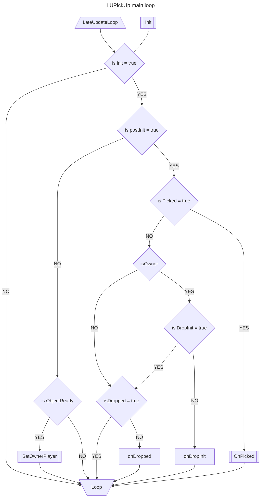
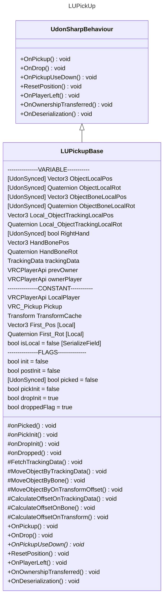

```mermaid
---
title: LUPickUp main loop
---

flowchart TD
	StartLoop[/LateUpdateLoop\] -->
	isInit{is init = true}

	isInit --NO--> EndLoop

	isInit --YES-->
	isPostInit{is postInit = true} --NO-->
	IsObjectReady{is ObjectReady} --YES-->
	PostInit[[SetOwnerPlayer]] -->
	EndLoop[\Loop/]


	IsObjectReady --NO-->
	EndLoop

	Init[[Init]] -.-
	isInit

	isPostInit --YES-->
	isPicked{is Picked = true}

	isPicked --NO--> 
	isOwnerOnDrop

	isDropped --YES-->
	EndLoop

	isOwnerOnDrop{isOwner} --NO-->
	isDropped

	isDropInit{is DropInit = true} -.YES.->
	isDropped{isDropped = true}
	
	isDropped --NO--> onDropped --> EndLoop

	isPicked --YES--> 
	onPicked[[OnPicked]] -->
	EndLoop

	isOwnerOnDrop --YES--> 
	isDropInit --NO--> 
	onDropInit --> EndLoop
```

```mermaid
flowchart TD
	subgraph "On Drop"
		

		MoveObjectTransformOnDropped[[Move Object Transform<br> on Dropped transform]] -->
		SetDroppedFlag_True

	end
	subgraph "on DropInit"

		FetchTrackingDataOnDrop[[Fetch TrackingData]]


		FetchTrackingDataOnDrop -->
		MoveObjectTransform_ByTrackingDataOnDrop[[Move Object Transform<br> by TrackingData]] -->
		CalculateOffsetOnPlayerOnDrop[[Calculate Offset<br> On Dropped transform]] -->
		SetDropInitFlag_True -->
		SyncOnDropInit((sync))
	end
	
	
	subgraph "On Picked"
		FetchBoneDataOnPicked[[Fetch BoneData]] -->
		isOwnerOnPicked{isOwner}

		isOwnerOnPicked --NO-->
		MoveObjectTransform_FromBone[[Move Object Transform<br> by BonePosition]]

		isOwnerOnPicked --YES-->
		FetchTrackingDataOnPicked[[Fetch TrackingData]] -->
		ispickInit{is pickInit = true}

		ispickInit --YES-->
		MoveObjectTransform_ByTrackingDataOnPickup
		
		ispickInit --NO-->
		onPickInit[[onPickInit]]

		onPickInit -->
		MoveObjectTransform_ByTrackingDataOnPickup[[Move Object Transform<br> by TrackingData]]

    end

	
	subgraph "PickInit"
		
		MoveObjectTransformOnPickup[[Move Object Transform<br> on Parent transform]] -->
		CalculateOffsetOnHand[[Calculate Offset<br> On Hand]]-->			
		CalculateOffsetOnBone[[Calculate Offset<br> On HandBone]]-->
		SyncOnPickInit((sync)) -->
		isVR{is VR} --YES--> noAction --> 
		SetpickInit_True
		
		
		isVR{is VR}--NO-->
		DeskTopWalkAround[[DeskTopWalkAround]] --> 
		SetpickInit_True
		
		DeskTopWalkAround -."2Sec late".- SyncOnDeskTop((sync))
	end
```

```mermaid
---
title: LUPickUp
---

classDiagram
  
  UdonSharpBehaviour <|-- LUPickupBase
  class UdonSharpBehaviour{
		+OnPickup() void
		+OnDrop() void
		+OnPickupUseDown() void
		+ResetPosition() void
		+OnPlayerLeft() void
		+OnOwnershipTransferred() void
		+OnDeserialization() void
  }
  class LUPickupBase {
		---------------VARIABLE-----------
		[UdonSynced] Vector3 ObjectLocalPos
		[UdonSynced] Quaternion ObjectLocalRot
		[UdonSynced] Vector3 ObjectBoneLocalPos 
		[UdonSynced] Quaternion ObjectBoneLocalRot
		Vector3 Local_ObjectTrackingLocalPos
    	Quaternion Local_ObjectTrackingLocalRot
		[UdonSynced] bool RightHand
		Vector3 HandBonePos
		Quaternion HandBoneRot
		TrackingData trackingData
		VRCPlayerApi prevOwner
    	VRCPlayerApi ownerPlayer
		---------------CONSTANT-----------
    	VRCPlayerApi LocalPlayer
		VRC_Pickup Pickup
		Transform TransformCache
		Vector3 First_Pos [Local]
		Quaternion First_Rot [Local]
		bool isLocal = false [SerializeField]
		---------------FLAGS--------------
		bool init = false
		bool postInit = false
		[UdonSynced] bool picked = false
		bool pickInit = false
		bool dropInit = true
		bool droppedFlag = true

		#onPicked() void
		#onPickInit() void
		#onDropInit() void
		#onDropped() void
		#FetchTrackingData() void
		#MoveObjectByTrackingData() void
		#MoveObjectByBone() void
		#MoveObjectByOnTransformOffset() void
		#CalculateOffsetOnTrackingData() void
		#CalculateOffsetOnBone() void
		#CalculateOffsetOnTransform() void
		+OnPickup() void
		+OnDrop() void
		+OnPickupUseDown() void*
		+ResetPosition() void
		+OnPlayerLeft() void
		+OnOwnershipTransferred() void
		+OnDeserialization() void

  }


```