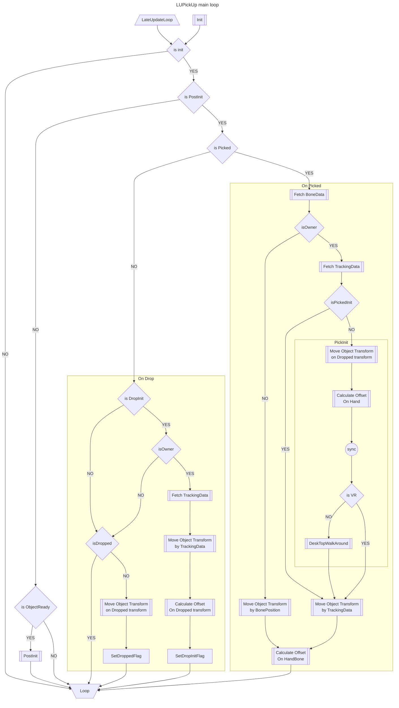
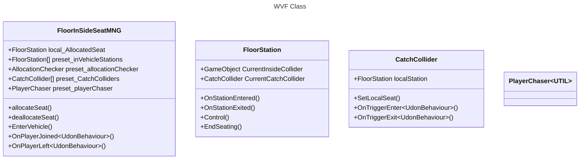

```mermaid
---
title: LUPickUp main loop
---

flowchart TD
	StartLoop[/LateUpdateLoop\] -->
	isInit{is init}

	isInit --NO--> EndLoop

	isInit --YES-->
	isPostInit{is postInit} --NO-->
	IsObjectReady{is ObjectReady} --YES-->
	PostInit[[PostInit]] -->
	EndLoop[\Loop/]


	IsObjectReady --NO-->
	EndLoop

	Init[[Init]] -->
	isInit

	isPostInit{is PostInit} --YES-->
	isPicked{is Picked}

	isPicked --NO-->
	isDropInit{is DropInit}

	isDropped --YES-->
	EndLoop

	subgraph "On Drop"
		
		isDropInit --NO-->
		isDropped{isDropped}

		isOwnerOnDrop{isOwner} --NO-->
		isDropped

		isDropInit --YES-->
		isOwnerOnDrop

		isOwnerOnDrop --YES-->
		FetchTrackingDataOnDrop[[Fetch TrackingData]]

		FetchTrackingDataOnDrop -->
		MoveObjectTransform_ByTrackingDataOnDrop[[Move Object Transform<br> by TrackingData]] -->
		CalculateOffsetOnPlayerOnDrop[[Calculate Offset<br> On Dropped transform]] -->
		SetDropInitFlag
		
		isDropped --NO-->
		MoveObjectTransformOnDropped[[Move Object Transform<br> on Dropped transform]] -->
		SetDroppedFlag
	end

	SetDropInitFlag -->
	EndLoop

	SetDroppedFlag -->
	EndLoop

	isPicked --YES-->
	FetchBoneDataOnPicked[[Fetch BoneData]]
	
	subgraph "On Picked"
		FetchBoneDataOnPicked -->
		isOwnerOnPicked{isOwner}

		isOwnerOnPicked --NO-->
		MoveObjectTransform_FromBone[[Move Object Transform<br> by BonePosition]] -->
		CalculateOffsetOnBone

		isOwnerOnPicked --YES-->
		FetchTrackingDataOnPicked[[Fetch TrackingData]] -->
		isPickedInit{isPickedInit}

		isPickedInit --YES-->
		MoveObjectTransform_ByTrackingDataOnPickup
		
		isPickedInit --NO-->
		MoveObjectTransformOnPickup[[Move Object Transform<br> on Dropped transform]]
		subgraph "PickInit"
			MoveObjectTransformOnPickup -->
			CalculateOffsetOnHand[[Calculate Offset<br> On Hand]]-->
			Sync((sync)) -->
			isVR{is VR}
			
			
			isVR{is VR}--NO-->
			DeskTopWalkAround[[DeskTopWalkAround]]

    	end
		isVR --YES-->
		MoveObjectTransform_ByTrackingDataOnPickup[[Move Object Transform<br> by TrackingData]] -->
		CalculateOffsetOnBone[[Calculate Offset<br> On HandBone]]

		DeskTopWalkAround -->
		MoveObjectTransform_ByTrackingDataOnPickup
		

		
    end
	CalculateOffsetOnBone --> EndLoop


```

```mermaid
---
title: WVF Class
---

classDiagram
	class FloorInSideSeatMNG{
		+FloorStation local_AllocatedSeat
		+FloorStation[] preset_inVehicleStations
		+AllocationChecker preset_allocationChecker
		+CatchCollider[] preset_CatchColliders
		+PlayerChaser preset_playerChaser
		+allocateSeat()
		+deallocateSeat()
		+EnterVehicle()
		+OnPlayerJoined~UdonBehaviour~()
		+OnPlayerLeft~UdonBehaviour~()
	}
	class FloorStation{
		+GameObject CurrentInsideCollider
		+CatchCollider CurrentCatchCollider
		+OnStationEntered<UdonBehaviour>()
		+OnStationExited<UdonBehaviour>()
		+Control()
		+EndSeating()
	}
	class CatchCollider{
		+FloorStation localStation
		+SetLocalSeat()
		+OnTriggerEnter~UdonBehaviour~()
		+OnTriggerExit~UdonBehaviour~()
	}
	class PlayerChaser ~UTIL~{
	}

```