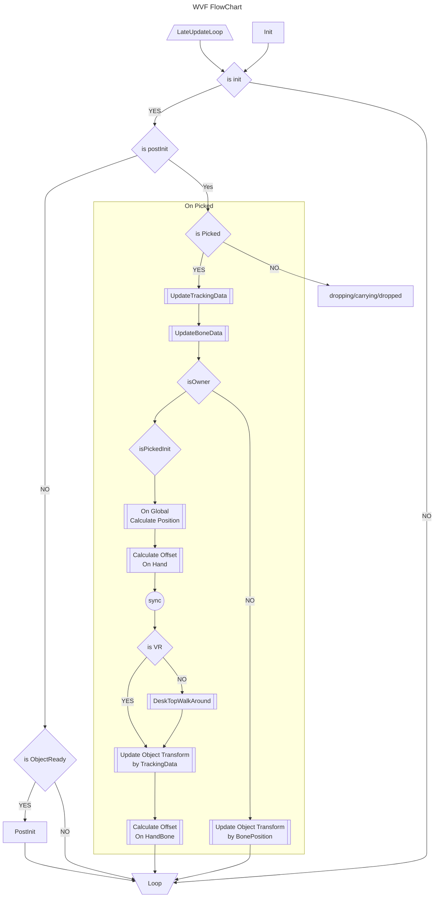
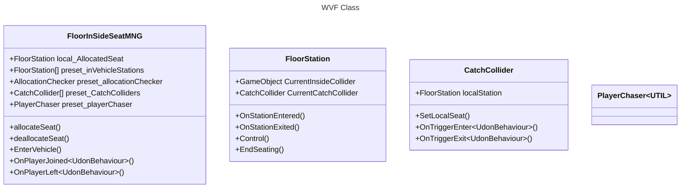

```mermaid
---
title: WVF FlowChart
---

flowchart TD
	StartLoop[/LateUpdateLoop\] --> isInit{is init} -->|YES| isPostInit{is postInit} -->|NO| IsObjectReady{is ObjectReady} -->|YES| PostInit --> EndLoop[\Loop/]
	isInit{is init} -->|NO| EndLoop
	IsObjectReady -->|NO| EndLoop
	Init --> isInit

	isPostInit{is postInit} --> |Yes| isPicked{is Picked} 
	subgraph "On Picked"
	isPicked -->|YES| UpdateTrackingData[[UpdateTrackingData]] --> UpdateBoneData[[UpdateBoneData]] --> isOwner{isOwner} --> isPickedInit{isPickedInit} --> 
	CalculatePosition_OnDrop[[On Global <br> Calculate Position]] --> 
	CalculateOffsetOnHand[[Calculate Offset<br> On Hand]]--> 
	Sync((sync)) --> isVR{is VR} -->|YES| UpdateObjectTransform_FromTrackingData[[Update Object Transform<br> by TrackingData]] --> CalculateOffsetOnBone[[Calculate Offset<br> On HandBone]]
	isVR{is VR}-->|NO| DeskTopWalkAround[[DeskTopWalkAround]] --> UpdateObjectTransform_FromTrackingData
	isOwner -->|NO| UpdateObjectTransform_FromBone[[Update Object Transform<br> by BonePosition]]
    end
	CalculateOffsetOnBone --> EndLoop
	UpdateObjectTransform_FromBone --> EndLoop
	isPicked -->|NO| dropping/carrying/dropped
```

```mermaid
---
title: WVF Class
---

classDiagram
	class FloorInSideSeatMNG{
		+FloorStation local_AllocatedSeat
		+FloorStation[] preset_inVehicleStations
		+AllocationChecker preset_allocationChecker
		+CatchCollider[] preset_CatchColliders
		+PlayerChaser preset_playerChaser
		+allocateSeat()
		+deallocateSeat()
		+EnterVehicle()
		+OnPlayerJoined~UdonBehaviour~()
		+OnPlayerLeft~UdonBehaviour~()
	}
	class FloorStation{
		+GameObject CurrentInsideCollider
		+CatchCollider CurrentCatchCollider
		+OnStationEntered<UdonBehaviour>()
		+OnStationExited<UdonBehaviour>()
		+Control()
		+EndSeating()
	}
	class CatchCollider{
		+FloorStation localStation
		+SetLocalSeat()
		+OnTriggerEnter~UdonBehaviour~()
		+OnTriggerExit~UdonBehaviour~()
	}
	class PlayerChaser ~UTIL~{
	}

```