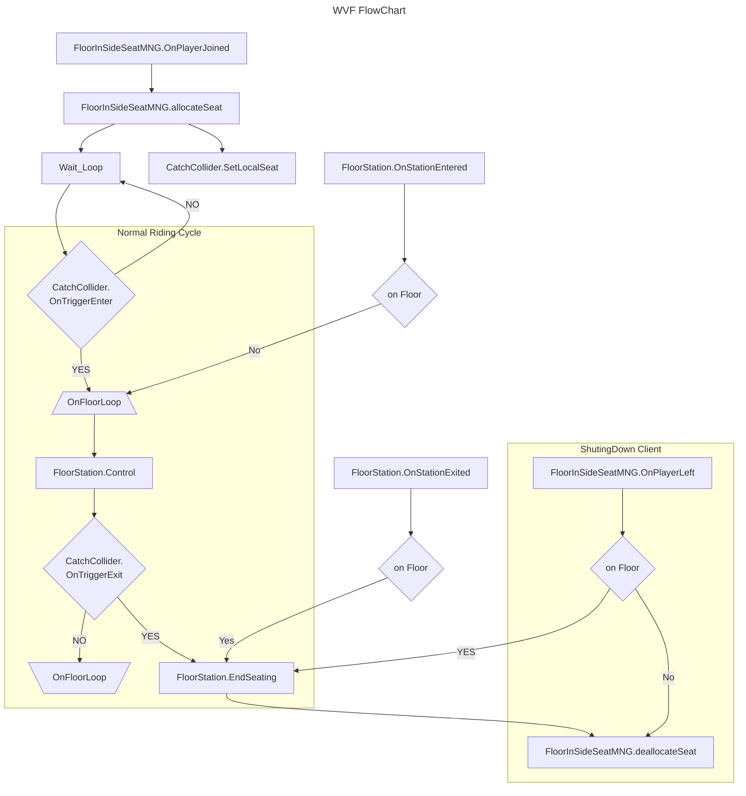
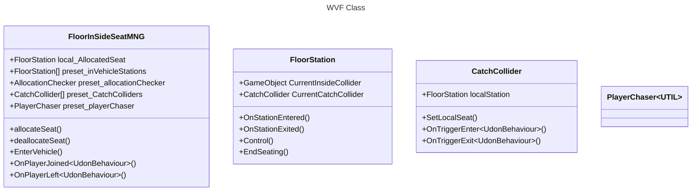

```mermaid
---
title: WVF FlowChart
---

flowchart TD
	FloorInSideSeatMNG.OnPlayerJoined --> FloorInSideSeatMNG.allocateSeat --> Wait_Loop
	FloorInSideSeatMNG.allocateSeat --> CatchCollider.SetLocalSeat
	Wait_Loop --> Event_CatchCollider.OnTriggerEnter{CatchCollider.OnTriggerEnter}
	Event_CatchCollider.OnTriggerEnter -->|NO| Wait_Loop 
	subgraph "Normal Riding Cycle"
	Event_CatchCollider.OnTriggerEnter{CatchCollider.<br>OnTriggerEnter} -->|YES| StartFloorLoop[/OnFloorLoop\] --> FloorStation.Control --> 
	Event_CatchCollider.OnTriggerExit -->|NO| RepeatFloorLoop[\OnFloorLoop/]

	Event_CatchCollider.OnTriggerExit{CatchCollider.<br>OnTriggerExit} -->|YES| FloorStation.EndSeating
    end

	FloorStation.OnStationExited --> ExitisOnFloor{on Floor} -->|Yes| FloorStation.EndSeating
	FloorStation.OnStationEntered --> EnteredisOnFloor{on Floor} -->|No| StartFloorLoop
	subgraph "ShutingDown Client"
	FloorInSideSeatMNG.OnPlayerLeft --> CheckSeating{on Floor} --> |YES|FloorStation.EndSeating--> FloorInSideSeatMNG.deallocateSeat
	
	CheckSeating{on Floor} --> |No|FloorInSideSeatMNG.deallocateSeat
	
    end
```

```mermaid
---
title: WVF Class
---

classDiagram
	class FloorInSideSeatMNG{
		+FloorStation local_AllocatedSeat
		+FloorStation[] preset_inVehicleStations
		+AllocationChecker preset_allocationChecker
		+CatchCollider[] preset_CatchColliders
		+PlayerChaser preset_playerChaser
		+allocateSeat()
		+deallocateSeat()
		+EnterVehicle()
		+OnPlayerJoined~UdonBehaviour~()
		+OnPlayerLeft~UdonBehaviour~()
	}
	class FloorStation{
		+GameObject CurrentInsideCollider
		+CatchCollider CurrentCatchCollider
		+OnStationEntered<UdonBehaviour>()
		+OnStationExited<UdonBehaviour>()
		+Control()
		+EndSeating()
	}
	class CatchCollider{
		+FloorStation localStation
		+SetLocalSeat()
		+OnTriggerEnter~UdonBehaviour~()
		+OnTriggerExit~UdonBehaviour~()
	}
	class PlayerChaser ~UTIL~{
	}

```