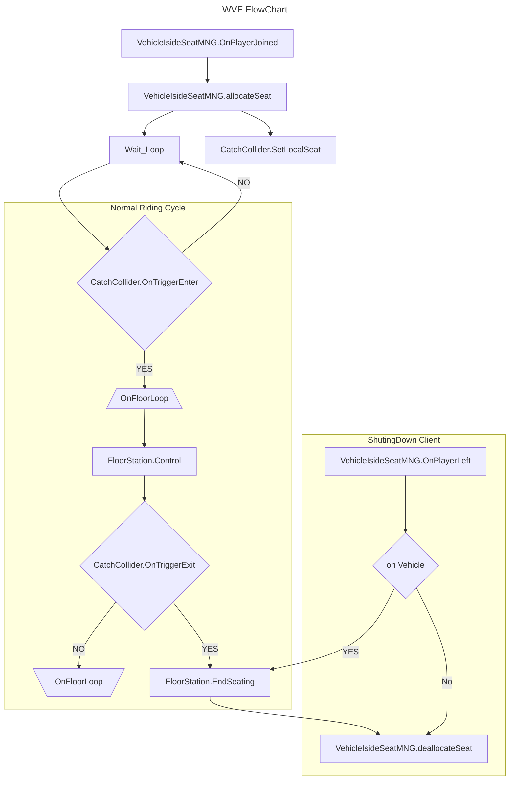
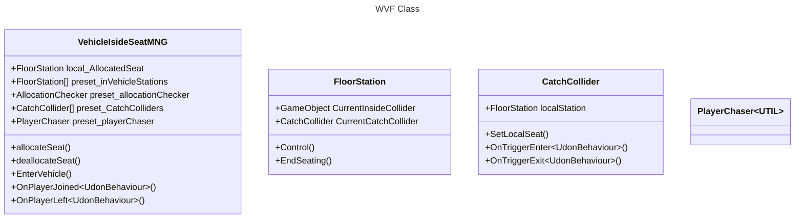

```mermaid
---
title: WVF FlowChart
---

flowchart TD
	VehicleIsideSeatMNG.OnPlayerJoined --> VehicleIsideSeatMNG.allocateSeat --> Wait_Loop
	VehicleIsideSeatMNG.allocateSeat --> CatchCollider.SetLocalSeat
	Wait_Loop --> Event_CatchCollider.OnTriggerEnter{CatchCollider.OnTriggerEnter}
	Event_CatchCollider.OnTriggerEnter{CatchCollider.OnTriggerEnter} -->|NO| Wait_Loop 
	subgraph "Normal Riding Cycle"
	Event_CatchCollider.OnTriggerEnter{CatchCollider.OnTriggerEnter} -->|YES| StartFloorLoop[/OnFloorLoop\] --> FloorStation.Control --> 
	Event_CatchCollider.OnTriggerExit{CatchCollider.OnTriggerExit} -->|NO| RepeatFloorLoop[\OnFloorLoop/]

	Event_CatchCollider.OnTriggerExit{CatchCollider.OnTriggerExit} -->|YES| FloorStation.EndSeating
    end

	subgraph "ShutingDown Client"
	VehicleIsideSeatMNG.OnPlayerLeft --> CheckSeating{on Vehicle} --> |YES|FloorStation.EndSeating--> VehicleIsideSeatMNG.deallocateSeat
	
	CheckSeating{on Vehicle} --> |No|VehicleIsideSeatMNG.deallocateSeat
	
    end
```

```mermaid
---
title: WVF Class
---

classDiagram
	class VehicleIsideSeatMNG{
		+FloorStation local_AllocatedSeat
		+FloorStation[] preset_inVehicleStations
		+AllocationChecker preset_allocationChecker
		+CatchCollider[] preset_CatchColliders
		+PlayerChaser preset_playerChaser
		+allocateSeat()
		+deallocateSeat()
		+EnterVehicle()
		+OnPlayerJoined~UdonBehaviour~()
		+OnPlayerLeft~UdonBehaviour~()
	}
	class FloorStation{
		+GameObject CurrentInsideCollider
		+CatchCollider CurrentCatchCollider
		+Control()
		+EndSeating()
	}
	class CatchCollider{
		+FloorStation localStation
		+SetLocalSeat()
		+OnTriggerEnter~UdonBehaviour~()
		+OnTriggerExit~UdonBehaviour~()
	}
	class PlayerChaser ~UTIL~{
	}

```